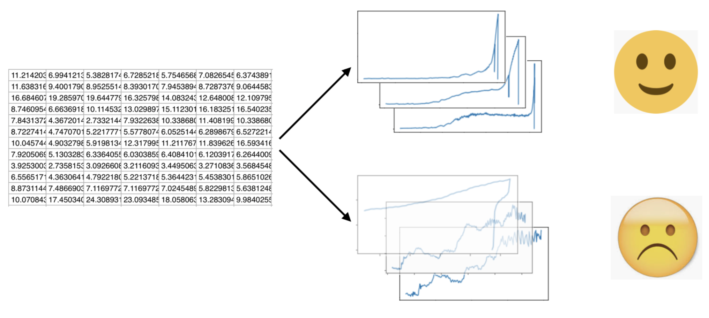

# nutAnomalyDetect

此项目致力于将机器学习等计算机技术应用到传统生产领域，具体地，对螺丝拧紧过程中产生的时序数据进行分析，预判可能存在的问题序列。
---

###项目流程

###检测模型

在缺乏标注数据的情况下，使用[谱聚类](https://en.wikipedia.org/wiki/Spectral_clustering)进行类别划分。谱聚类在多特征数据上表现好于Kmeans，有更广的适用范围。

###开发日志

29/03/2019 

解决bootstrap选项卡CSS样式丢失问题。bootstrap3代码和4的css不兼容。

30/03/2019

